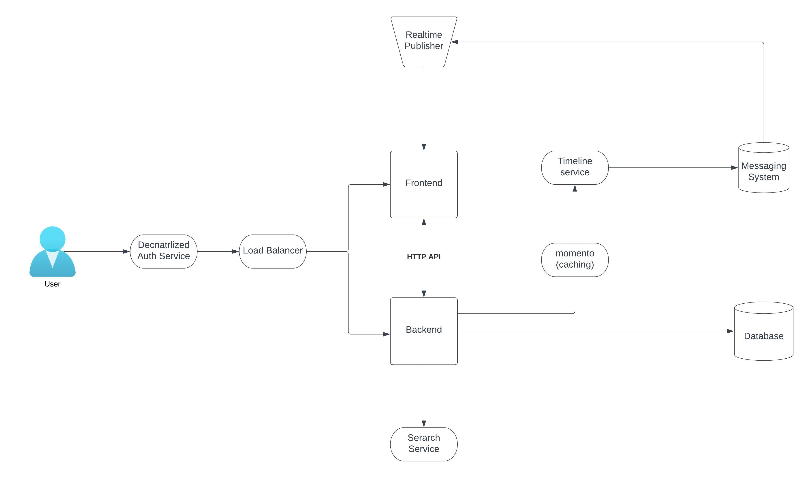
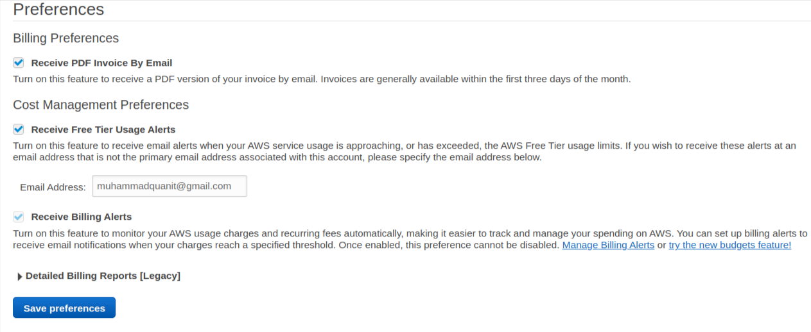
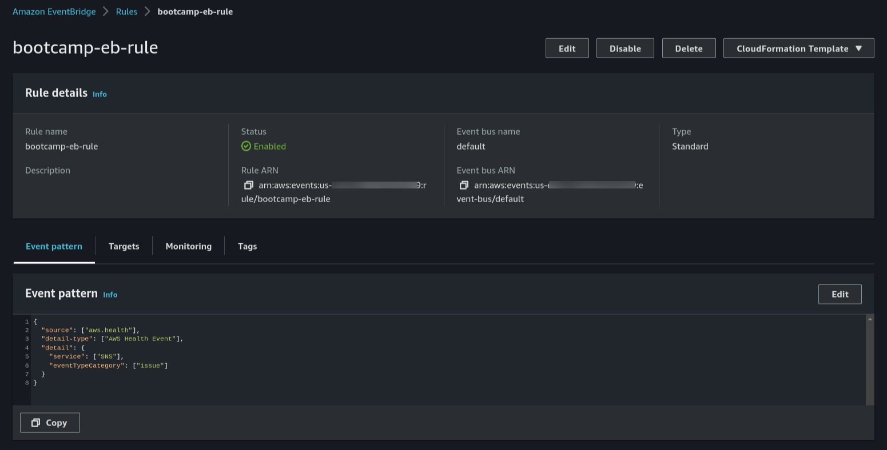

# Week 0 — Billing and Architecture
<br />

# Theoretical Tasks
Before doing any practical work, I've documented my theoretical assignments first. 
The things I've studied in theory after watching all the videos from Andrew, Chris, Margaret & Shala.

<br />

## How to gather functional and non-functional requirements

1. What should be the **scope** of the project means what features and functionalities are we covering in our first MVP
2. What should be the **cost** of our project so that we can measure our budgets and resources we utilize to create the project.
3. In what **time** frame we are creating the project or atleast our first MVP, because time would be the main constraint for stakeholders.

By Calculating all the above points we can measure the quality of our project that we can share with our stakeholders or clients.

Some Notes that can help to design our app solution in a better way.

- Ephemeral-first Micro Blogging Application
- Fractional CTO
- Partly developed app - keep or rebuild
- Monetizing the platfrom
- Frontend - React.js
- Backend - Python  (flask)
- Careful on budget
- Can user upload content?
- User Engagment
- AWS - services, containers, budgets, Infrastructure
- Architecture & ongoing estimate 
- Personas - who can help to create our application

<br />

## Different types of Achitectures

- TOGAF Architecture
- C4 Model
- AWS wel architected framework & tool

Here's the logical and napkin diagram for cruddr application


[Lucidchart Link](https://lucid.app/documents/view/0fa947d2-825d-4024-bcc4-fde549375f9c/view) for Napkin Digram

<br />


[Lucidchart Link](https://lucid.app/lucidchart/107716e7-8c87-4e91-9533-eec565b05b51/view) for Logical Digram


<br />
<br />

# Practical Tasks

Here's the practicals that I've performed for this assignment.

- Created Gitpod Account and setup my workspace - [GitPod Workspace](https://mohammadqua-awsbootcamp-3mtwn1cehr4.ws-us87.gitpod.io/)
- Created Github repository from ExamPro template and connected it with my gitpod workspace
- Created account on student portal and update my details in user settings
- Setup IAM user (mquanit-u1) on AWS IAM service as I've already an AWS account so didn't need to create another account
- Setup MFA on root account and gave billing access to IAM as i need to monitor billing from my IAM user
- Connect VSCode desktop to my gitpod workspace via SSH connection as I am more comnfortable working on desktop version

After setting up VSCode desktop from Gitpod succesfully below are the steps I've followed,

### Configure AWS Cli on gitpod environment

<br />

Install AWS cli from this [link](https://docs.aws.amazon.com/cli/latest/userguide/getting-started-install.html) and ran below cmds
```
curl "https://awscli.amazonaws.com/awscli-exe-linux-x86_64.zip" -o "awscliv2.zip"
unzip awscliv2.zip
sudo ./aws/install
```

Configure AWS env variables in gitpod environment using below cmds
```
gp env AWS_SECRET_ACCESS_KEY=*****
gp env AWS_ACCESS_KEY_ID=*****
gp env AWS_DEFAULT_REGION=*****
gp env AWS_ACCOUNT_ID=*****
```

Verified my AWS configuration in gitpod using
```
$ aws sts get-caller-identity

result: {
  UserId: "*********",
  Account: "********"
  Arn: "arn:aws:iam::********:user/mquanit-u1"
}
```


### Create Budget & Alarm to monitor my Spending

I've created 2 budgets one for my credits and another one for actual USD's incase some service doesn't use credits.

```
aws budgets create-budget \
    --account-id ***REMOVED*** \
    --budget file://aws/json/budget.json \
    --notifications-with-subscribers file://aws/json/notifications-with-subscribers.json
```

The contents of ```budget.json```

```
{
  "BudgetLimit": {
      "Amount": "5",
      "Unit": "USD"
  },
  "BudgetName": "CLI Tag Budget",
  "BudgetType": "COST",
  "CostFilters": {
      "TagKeyValue": [
          "user:Key$value1",
          "user:Key$value2"
      ]
  },
  "CostTypes": {
      "IncludeCredit": true,
      "IncludeDiscount": true,
      "IncludeOtherSubscription": true,
      "IncludeRecurring": true,
      "IncludeRefund": true,
      "IncludeSubscription": true,
      "IncludeSupport": true,
      "IncludeTax": true,
      "IncludeUpfront": true,
      "UseBlended": false
  },
  "TimePeriod": {
      "Start": 1477958399,
      "End": 3706473600
  },
  "TimeUnit": "MONTHLY"
}
```
The contents of ```notifications-with-subscribers.json```

```
[
  {
      "Notification": {
          "ComparisonOperator": "GREATER_THAN",
          "NotificationType": "ACTUAL",
          "Threshold": 60,
          "ThresholdType": "PERCENTAGE"
      },
      "Subscribers": [
          {
              "Address": "*******",
              "SubscriptionType": "EMAIL"
          }
      ]
  }
]
```


Then i've setup billing alams by navigating into ```Billing Preferences``` in AWS console & checked all the preferences and saved it.



Note: I've also enabled AWS CLI auto prompt using ```aws --cli-auto-prompt```. Thanks for this tip :-)


### Setup EventBridge for SNS Health Checkup (Bonus Work)

I've setup event bridge by navigating into EventBridge and create a rule for looking healthcheck for any kind of SNS topic issues. Below is my eventbridge rule details.



As you can see in the screenshot, Ive provided the event pattern for SNS topic issues.

```
{
  "source": ["aws.health"],
  "detail-type": ["AWS Health Event"],
  "detail": {
    "service": ["SNS"],
    "eventTypeCategory": ["issue"]
  }
}
```
