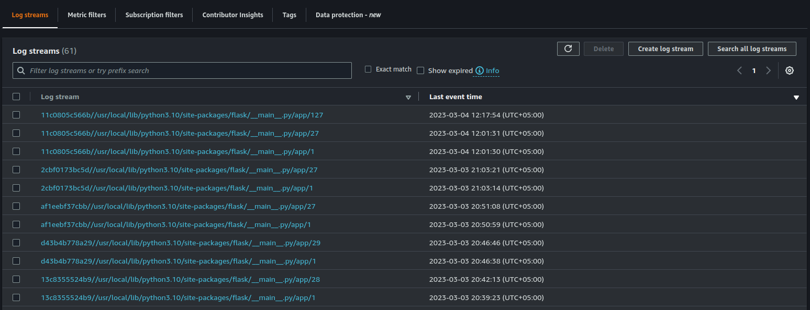
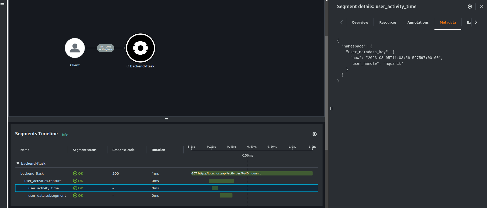

# Week 2 — Distributed Tracing

After watching your live stream, Ashish's & Chirag's Video, I've the challenges along with the stretched ones below.

# **Practical Implementaion of Challenges**

### **Configure Honeycomb on Python & React**

After digging up on honeycomb, I've implemented honeycomb tracing on python and react app for monitoring events and traces.

<br />

# **HoneyComb Python Implementation**

``` python
### app.py

# Import Honeycomb deps ----
from opentelemetry import trace
from opentelemetry.instrumentation.flask import FlaskInstrumentor
from opentelemetry.instrumentation.requests import RequestsInstrumentor
from opentelemetry.exporter.otlp.proto.http.trace_exporter import OTLPSpanExporter
from opentelemetry.sdk.trace import TracerProvider
from opentelemetry.sdk.trace.export import BatchSpanProcessor

# Initialize tracing and an exporter that can send data to Honeycomb
provider = TracerProvider()
processor = BatchSpanProcessor(OTLPSpanExporter())
provider.add_span_processor(processor)
trace.set_tracer_provider(provider)
tracer = trace.get_tracer(__name__)

### home_activities.py
## Home Activities Service
def run(logger):
        logger.info("Home activities in cloudwatch...")
        with tracer.start_as_current_span("home-activites-mock-data"):
            span = trace.get_current_span()
            now = datetime.now(timezone.utc).astimezone()
            span.set_attribute("app.now (current timezone)", now.isoformat())
            now = datetime.now(timezone.utc).astimezone()
            results = [{
              ...
            }]
            span.set_attribute("app.result_length", len(results))
            return results


# notifications_activities.py
from datetime import datetime, timedelta, timezone
from opentelemetry import trace
from opentelemetry.trace.status import Status, StatusCode


tracer = trace.get_tracer("notifications.activities")

class NotificationsActivities:
  def run():
    with tracer.start_as_current_span("notification-mock-span") as span:
      # Set attributes on the span
      span.set_attribute("notification", "cruddr")
    
      # Set the status of the span
      span.set_status(Status(StatusCode.OK, "Notification Initialized."))
      now = datetime.now(timezone.utc).astimezone()
      results = [{
        'uuid': '68f126b0-1ceb-4a33-88be-d90fa7109eee',
        'handle':  'Coco Melon',
        'message': 'I am a youtube channel',
        'created_at': (now - timedelta(days=2)).isoformat(),
        'expires_at': (now + timedelta(days=5)).isoformat(),
        'likes_count': 5,
        'replies_count': 1,
        'reposts_count': 0,
        'replies': [{
          'uuid': '26e12864-1c26-5c3a-9658-97a10f8fea67',
          'reply_to_activity_uuid': '68f126b0-1ceb-4a33-88be-d90fa7109eee',
          'handle':  'Worf',
          'message': 'This post has no honor!',
          'likes_count': 0,
          'replies_count': 0,
          'reposts_count': 0,
          'created_at': (now - timedelta(days=2)).isoformat()
        }],
      }]
      return results
```

<br />

## **HoneyComb React Implementation**

``` javascript
// services/tracing.js

// tracing.js
import { OTLPTraceExporter } from '@opentelemetry/exporter-trace-otlp-http';
import { WebTracerProvider, BatchSpanProcessor } from '@opentelemetry/sdk-trace-web';
import { ZoneContextManager } from '@opentelemetry/context-zone';
import { Resource }  from '@opentelemetry/resources';
import { SemanticResourceAttributes } from '@opentelemetry/semantic-conventions';

const exporter = new OTLPTraceExporter({
  url: 'https://api.honeycomb.io/v1/traces',
});

const provider = new WebTracerProvider({
  resource: new Resource({
    [SemanticResourceAttributes.SERVICE_NAME]: 'browser',
  }),
});

provider.addSpanProcessor(new BatchSpanProcessor(exporter));

provider.register({
  contextManager: new ZoneContextManager()
});

<br />
// notificationsFeedPage.js

import './NotificationsFeedPage.css';
import React from "react";
import { trace, context, SpanStatusCode, } from '@opentelemetry/api';


import DesktopNavigation  from '../components/DesktopNavigation';
import DesktopSidebar     from '../components/DesktopSidebar';
import ActivityFeed from '../components/ActivityFeed';
import ActivityForm from '../components/ActivityForm';
import ReplyForm from '../components/ReplyForm';

import '../services/tracing'

// [TODO] Authenication
import Cookies from 'js-cookie'

const tracer = trace.getTracer('notification-request.tracer');

export default function NotificationsFeedPage() {
  const [activities, setActivities] = React.useState([]);
  const [popped, setPopped] = React.useState(false);
  const [poppedReply, setPoppedReply] = React.useState(false);
  const [replyActivity, setReplyActivity] = React.useState({});
  const [user, setUser] = React.useState(null);
  const dataFetchedRef = React.useRef(false);

  const loadData = async () => {
    const backend_url = `${process.env.REACT_APP_BACKEND_URL}/api/activities/notifications`

    // Setup new span for notification service
    return tracer.startActiveSpan(`Notification Request: Get ${backend_url}`, async (span) => {

      // construct W3C traceparent header
      const traceparent = `00-${span.spanContext().traceId}-${span.spanContext().spanId}-01`;

      try {
        const res = await fetch(backend_url, {
          method: "GET",
          traceparent: traceparent,
        });

        // Set Span Attributes for http request
        span.setAttributes({
          'http.method': 'GET',
          'http.url': backend_url,
          'response.status_code': res.status,
        });

        let resJson = await res.json();
        if (res.status === 200) {

          // Set Span status for request status code
          span.setStatus({ code: SpanStatusCode.OK });
          setActivities(resJson)
        } else {
          console.log(res)
        }
      } catch (err) {
        console.log(err);
        // Set Span for any error message
        span.setStatus({
          code: SpanStatusCode.ERROR,
          message: err.message,
        });
        throw err;
      } finally {

        // finally end the span
        span.end();
      }
    });
  };
}
```


<br />

# **Configure Rollbar on Python**

``` python
# Import Rollbar Deps ---
import rollbar
import rollbar.contrib.flask
from flask import got_request_exception


## Rollbar init code. You'll need the following to use Rollbar with Flask.
## This requires the 'blinker' package to be installed
@app.before_first_request
def init_rollbar():
    """init rollbar module"""
    rollbar.init(
        # access token
        rollbar_access_token,
        # environment name
        'development',
        # server root directory, makes tracebacks prettier
        root=os.path.dirname(os.path.realpath(__file__)),
        # flask already sets up logging
        allow_logging_basic_config=False)

    # send exceptions from `app` to rollbar, using flask's signal system.
    got_request_exception.connect(rollbar.contrib.flask.report_exception, app)


# Rollbar testing function
@app.route('/rollbar/test')
def rollbar_test():
    rollbar.report_message("This is custom error", "warning")
    return "Hello World!"
```


<br />

# **Configure Cloudwatch on Python**

``` python
# Cloudwatch logger deps ---
import watchtower
import logging

# Configuring Logger to Use CloudWatch
LOGGER = logging.getLogger(__name__)
LOGGER.setLevel(logging.DEBUG)
console_handler = logging.StreamHandler()
cw_handler = watchtower.CloudWatchLogHandler(log_group='cruddur')
LOGGER.addHandler(console_handler)
LOGGER.addHandler(cw_handler)

LOGGER.info("Init log...")

# home_activities.py
class HomeActivities:
    def run(logger):
        logger.info("Home activities in cloudwatch...")
        {...}
        return results

```




# **Configure XRAY on Python**

``` python
# AWS xray-sdk deps ----
from aws_xray_sdk.core import xray_recorder
from aws_xray_sdk.ext.flask.middleware import XRayMiddleware


# Initializing xray recorder
xray_url = os.getenv("AWS_XRAY_URL")
xray_recorder.configure(service='backend-flask', dynamic_naming=xray_url)
XRayMiddleware(app, xray_recorder)

# app.py
@app.route("/api/activities/@<string:handle>", methods=['GET'])

# capture xray segment
@xray_recorder.capture('user_activities.capture')
def data_handle(handle):
    model = UserActivities.run(handle)
    if model['errors'] is not None:
        return model['errors'], 422
    else:
        return model['data'], 200


# user_activities.py
try:
            with xray_recorder.capture('user_activity_time') as subsegment_1:
                model = {
                    'errors': None,
                    'data': None
                }

                now = datetime.now(timezone.utc).astimezone()

                dict = {
                    "now": now.isoformat(),
                    "user_handle": user_handle,
                }

                # Add metadata or annotation to sub segment-1 if necessary
                subsegment_1.put_metadata(
                    'user_metadata_key', dict, 'namespace')
                subsegment_1.put_annotation('time_now', now.isoformat())

                if user_handle == None or len(user_handle) < 1:
                    model['errors'] = ['blank_user_handle']
                else:
                    now = datetime.now()
                    results = [{
                        'uuid': '248959df-3079-4947-b847-9e0892d1bab4',
                        'handle':  'M Quanit',
                        'message': 'Cloud is fun!',
                        'created_at': (now - timedelta(days=1)).isoformat(),
                        'expires_at': (now + timedelta(days=31)).isoformat()
                    }]
                    model['data'] = results

            # Add metadata or annotation to subsegment 2 if necessary
            sub_segment = xray_recorder.begin_subsegment(
                "user_data.subsegment")
            sub_segment.put_annotation('user.result.length', len(results))

        finally:
            xray_recorder.end_subsegment()
        return model

```



<br />

# Observability Security Considerations

After watching Ashish's video of Security consideration in observability, Here are some security considerations to keep in mind when implementing observability:

1. Data privacy: Make sure that sensitive data is not exposed through your observability infrastructure.

2. Access control: Limit access to your observability infrastructure to only those who need it.

3. Authentication and authorization: Use strong authentication and authorization mechanisms to control access to your observability infrastructure.

4. Encryption: Make sure that all data transmitted over the network is encrypted to prevent eavesdropping and tampering.

5. Monitoring and alerting: Monitor your observability infrastructure for signs of unauthorized access or suspicious activity. Set up alerts to notify you of potential security incidents.

6. Secure coding practices: Follow secure coding practices when developing your instrumentation and observability tools.

7. Incident response: Have an incident response plan in place in case of a security breach.

By keeping these security considerations in mind, you can help ensure that your observability infrastructure is both effective and secure.